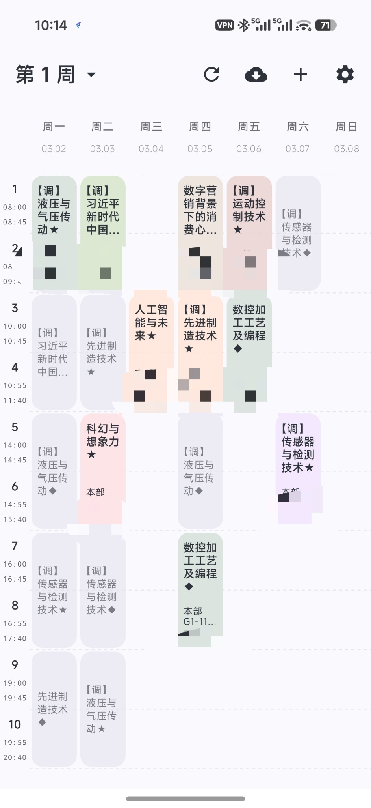
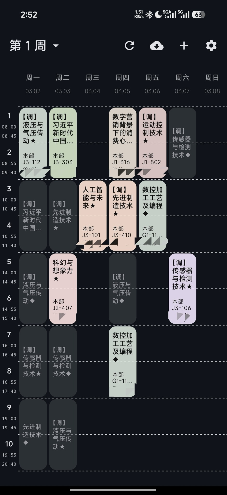
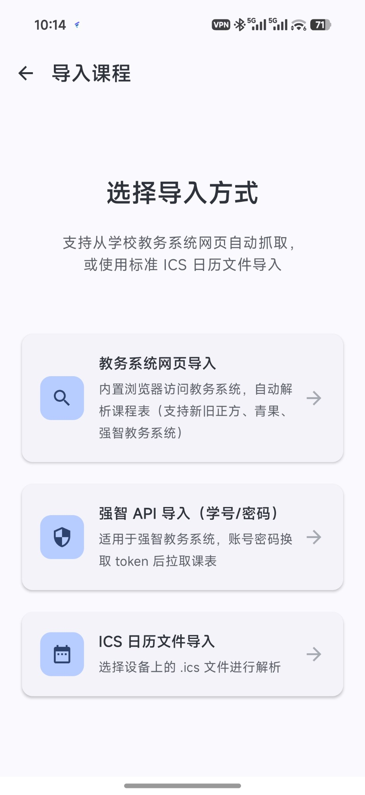
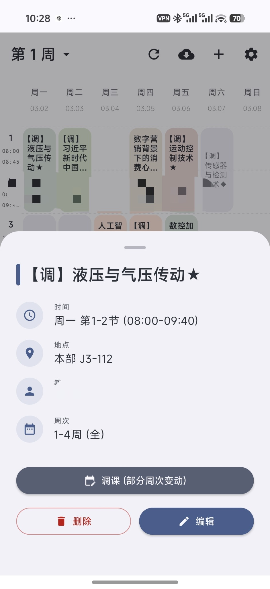
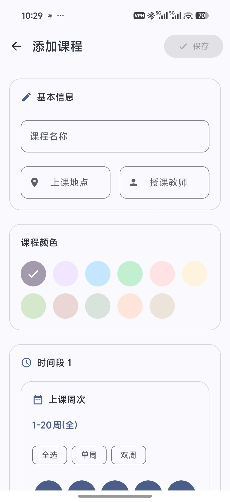

# 齐鲁课表（基于 Dawn Course 的非官方修改版）

Android 课表、齐鲁工业大学学校登录、成绩分项/绩点查询及 Excel 导出。独立包名 `com.qlucampus.app`，版本 `0.2.10`。成绩、空教室和学校课表导入查询前先检测网络：已有 VPN 或学校网址可访问时直接继续，否则打开手机 aTrust，返回后继续一次原操作。也可手动打开或关闭自动跳转。aTrust 的登录和 VPN 连接由用户在其原界面完成。

可选 Wake Up、云雾蓝、鼠尾草、奶油杏、雾紫及原有配色，支持浅色/深色模式。Wake Up 使用浅蓝灰渐变和粉蓝杏白字卡片。课程边缘线独立开关，默认关闭。自定义背景可延伸到顶栏、导航栏、课程与面板；栏位和面板默认显示原图，独立控制毛玻璃及遮罩，不再重复叠加。课程颜色适应背景默认开启，保护课程名和地点的对比度；Wake Up 关闭自适应后保留粉彩原色。
「设置 → 字体与文字颜色」支持系统、衬线、等宽、加粗字体，覆盖课程、地点、日期、导航等文字。颜色可跟随风格、按背景自动黑白或自定义；提供色板、HSV 滑杆和 #RRGGBB 色值。自动模式按栏位所在区域及遮罩判断，课程保留对比保护；成绩合格/挂科和错误提示的语义色不被覆盖。


已启用自动版本检查、手动检查和应用内下载安装，默认使用 [本项目 GitHub 发布源](https://github.com/ZCJ-GIF/QluCampus/releases)。已安装 0.2.7 及以后版本可在「设置 → 检查更新」下载新版；更早版本需先手动覆盖安装最新版。应用启动时最多每六小时自动检查一次。安装前校验哈希、包名、版本和签名，交由 Android 系统确认。GitHub 不可达时显示失败，不改动学校缓存。

非本周课程默认灰色显示；数字总评以 60 分为界，用绿色“合格”加淡绿背景、红色“挂科”加淡红背景标注。默认采用五大节作息，晚课 18:25–19:55 连上。默认周课表采用日期同行工具栏、竖向课程卡片和半透明底栏；末节可滑动看全。包含桌面组件添加状态、澎湃系统手动添加说明及系统登记检测。已核对空教室官网查询与参数，Android 原生学校结果仍待手机登录核验。

- [构建、架构与学校适配维护](docs/QLU-MAINTENANCE.md)
- [修改记录与上游基线](docs/QLU-CHANGELOG.md)
- [已完成验证与待联调项目](docs/QLU-VALIDATION.md)
- [Dawn Course 上游及作者 HF-CYGG](https://github.com/HF-CYGG/Dawn-Course)

修改日期：2026-09-21。沿用 GPL-3.0；下文保留上游项目介绍，上游云端自动修复、脚本同步和更新服务在齐鲁版中关闭；版本更新仅使用本项目独立发布源，实际功能以以上维护说明为准。

# Dawn Course（破晓课程表，上游说明）

> 免费、开源（GPL-3.0）、无广告、本地优先的 Android 课程表应用  
> 专注离线可用、数据可迁移与长期可维护的现代 Android 工程实践（Kotlin + Compose + Clean Architecture）

## 项目定位

破晓课程表（Dawn Course）是一款面向学生日常使用的课程表应用，提供从教务系统导入、课程管理、提醒与个性化显示等核心能力。项目坚持“用户数据主权”与“本地优先”原则：在不强制云账号的前提下，尽可能做到离线可用、可备份、可迁移。

## 界面预览

<table>
  <tr>
    <th width="50%">图 1：课程表（浅色）</th>
    <th width="50%">图 2：课程表（深色）</th>
  </tr>
  <tr>
    <td align="center"></td>
    <td align="center"></td>
  </tr>
</table>

<table>
  <tr>
    <th width="33.33%">图 3：导入课程</th>
    <th width="33.33%">图 4：课程详情</th>
    <th width="33.33%">图 5：添加课程</th>
  </tr>
  <tr>
    <td align="center"></td>
    <td align="center"></td>
    <td align="center"></td>
  </tr>
</table>

## 核心原则

本项目严格遵循以下原则：

1. **永久免费 & 开源**：遵循 GPL-3.0 协议。
2. **零干扰**：无广告、无会员强绑定、无非必要推送。
3. **本地优先**：核心功能离线可用，不强制依赖云端服务。
4. **可迁移**：提供多种导入方式，并支持备份与还原能力。
5. **可维护**：以可测试性、可替换性、长期维护为第一优先级。

## 主要功能

### 课程与展示

- 周视图 / 日视图课表展示，支持滑动切换
- 课程信息管理：名称、地点、教师、颜色等
- 多学期管理与切换
- 动态壁纸背景：支持高斯模糊与亮度调节
- Material You（Material 3）动态取色
- 桌面小组件（Jetpack Glance）：日/周视图组件，适配系统主题

### 智能导入与更新

- 教务系统导入：适配新正方、强智、青果等主流系统（WebView + JS 解析）
- ICS 文件导入：支持标准日历格式（.ics）
- 覆盖导入机制：导入时清理旧数据，避免混淆
- 脚本云同步：导入/自动更新脚本支持从云端拉取，并具备本地缓存与内置 Assets 兜底

### 同步与备份（本地优先）

- 本地备份与还原：支持导出/导入备份文件，并在还原前展示备份预览信息
- WebDAV 同步（可选）：用于跨设备备份文件上传/下载，支持自动同步策略

### 贴心提醒与维护

- 上课提醒
- 自动静音/免打扰策略（按设置联动）
- 应用内更新检查与提示

## 快速开始（开发者）

### 环境要求

- **JDK**：17+
- **Android Studio**：需支持 AGP 9.x 的版本（建议使用当前最新稳定版）
- **Android SDK**：API 36（Compile SDK）

### 构建步骤

1. 克隆仓库：

   ```bash
   git clone https://github.com/HF-CYGG/Dawn-Course.git
   ```

2. 用 Android Studio 打开项目根目录，等待 Gradle Sync 完成
3. 连接真机或启动模拟器
4. 运行 `app` 模块

可选（推荐）：安装 Git 钩子以确保提交前自动执行质量检查：

```bash
./gradlew installGitHooks
```

## 技术栈与版本

以下版本信息以仓库默认配置为准；完整依赖以 `gradle/libs.versions.toml` 为最终来源。

- **语言**：Kotlin 2.2.10
- **UI**：Jetpack Compose（Material 3，BOM 2026.08.00）
- **架构**：MVVM + Clean Architecture（App / Domain / Data / UI 分层）
- **依赖注入**：Hilt 2.59.2
- **异步**：Coroutines + Flow
- **数据库**：Room 2.6.1
- **网络**：Retrofit + OkHttp
- **图片加载**：Coil
- **导航**：Navigation Compose
- **小组件**：Jetpack Glance 1.1.1
- **脚本引擎**：QuickJS
- **后台任务**：WorkManager

## 项目结构

项目采用多模块结构，强调边界清晰与依赖方向可控：

```text
DawnCourse/
├── app/                # 壳工程：Application 初始化 / DI / 导航
├── core/               # 核心层
│   ├── data/           # 数据层：Repository 实现 / DB / DataStore / Sync
│   ├── domain/         # 领域层：UseCase / Model（纯 Kotlin，可测试）
│   └── ui/             # 通用 UI：主题 / 组件
└── feature/            # 功能层：导入/课表/设置/小组件/更新等（相互解耦）
```

服务端不属于本仓库，独立维护在
[HF-CYGG/DawnCourse-server](https://github.com/HF-CYGG/DawnCourse-server)。本地若存在被忽略的
`server/` 目录，它只是独立仓库的工作副本，不会由 Dawn Course 的 GitHub Actions 自动同步。
涉及 App 与服务端协议的发布必须分别更新、验证并提交两个仓库，并在发布概要中记录双方 commit hash；
不得恢复已删除的常驻跨仓库同步 Token。

### 分层依赖（强制）

- UI → ViewModel → UseCase → Repository → DataSource
- feature 模块之间不直接依赖
- UI 不直接访问 DAO
- ViewModel 不持有 Android Context

## 脚本体系（导入相关）

导入与自动更新依赖一组可独立演进的 JavaScript 脚本，用于 WebView 交互与 HTML 提取/解析：

- 内置脚本（兜底）：`app/src/main/assets/js/`（WebView 交互）与 `feature/import/src/main/assets/parsers/`（HTML 解析器：`common_parser_utils.js` / `zhengfang.js` / `qiangzhi.js` / `kingosoft.js`）
- 云端脚本（可更新）：独立 `DawnCourse-server` 仓库中的 `html/scripts/js/`
- 获取策略：云端 → 本地缓存 → Assets 兜底（保证离线可用与可控升级）

> ⚠️ 修改内置解析器脚本后，**务必同步更新云端同名脚本**（或提升其版本号触发客户端重新拉取）。
> 否则已缓存旧云端脚本的设备会继续用旧版本覆盖修好的内置兜底。

如需贡献新的教务系统脚本，请参考：

- [教务系统解析脚本开发指南](parser_contribution_guide.md)

## LLM 兜底解析服务（可选）

当动态脚本解析失败时，可部署 LLM 兜底解析服务提升导入成功率。该服务由 nginx 反代，端口默认 10000。

### 运行方式

```bash
git clone https://github.com/HF-CYGG/DawnCourse-server.git
cd DawnCourse-server
docker-compose up -d --build
```

### 配置方式（环境变量）

在独立服务端仓库的 `docker-compose.yml` 中配置以下环境变量即可切换模型与策略（解析默认复用模型 1）：

- 模型 1（低成本总结 + 解析）
  - LLM_SUMMARY_PROVIDER / LLM_SUMMARY_API_KEY / LLM_SUMMARY_MODEL / LLM_SUMMARY_BASE_URL
- 模型 2（高成本脚本修复）
  - LLM_SCRIPT_PROVIDER / LLM_SCRIPT_API_KEY / LLM_SCRIPT_MODEL / LLM_SCRIPT_BASE_URL
- 模型深度适配与扩展
  - LLM_MODEL_ALIAS_JSON：模型名称别名映射表（JSON格式，例如 `{"glm5 5.1":"glm-5-1"}`）
  - LLM_SUMMARY_API_STYLE / LLM_SCRIPT_API_STYLE：强制指定 API 风格（chat 或 responses）
  - LLM_SUMMARY_REQUEST_EXTRA_JSON / LLM_SCRIPT_REQUEST_EXTRA_JSON：额外请求体参数扩展（如 response_format）
- 用量与费用统计
  - LLM_USAGE_ENABLED：是否开启用量统计（默认 true）
  - LLM_SUMMARY_USAGE_URL / LLM_SCRIPT_USAGE_URL：自定义 Token 用量查询接口
  - LLM_SUMMARY_COST_URL / LLM_SCRIPT_COST_URL：自定义费用查询接口
- 队列策略
  - MIN_QUEUE_SIZE：触发脚本修复的最小提交数
  - MERGE_WINDOW_MS：合并窗口（毫秒）
  - REPROCESS_WINDOW_MS：脚本更新后 24 小时内的二次提交处理窗口
- Redis（内置）
  - REDIS_URL：默认 redis://redis:6379
- 限流与签名
  - RATE_LIMIT_PER_MIN / RATE_LIMIT_SCHOOL_PER_MIN
  - SCRIPT_SIGN_KEY：脚本签名密钥（可选，HMAC）
  - SCRIPT_SIGN_PRIVATE_KEY：脚本签名私钥（可选，RSA）
- 指标与统计
  - SCHOOL_METRICS_FILE：学校维度统计输出 TXT 文件路径
  - METRICS_FLUSH_MS：学校统计写盘间隔（毫秒）
- 持久化与升级兼容
  - SCRIPT_OUTPUT_DIR：脚本与元数据输出目录（建议挂载为持久化卷）
  - LEGACY_SCRIPT_OUTPUT_DIRS：老版本脚本目录列表（逗号分隔），用于升级时回退读取与自动迁移

### 支持的模型名称（示例）

以下为当前服务端已适配的模型名称形态（仅列出常见示例）。各平台实际可用模型以官方文档为准；如果你习惯使用非标准写法，可用 `LLM_MODEL_ALIAS_JSON` 做别名映射。

- OpenAI（provider: gpt / openai）
  - GPT-5 系列（自动使用 Responses API）：`gpt-5`、`gpt-5.1`、`gpt-5.2`、`gpt-5.3`、`gpt-5.4`
  - Codex 系列（自动使用 Responses API）：`gpt-5.2-codex`、`gpt-5.3-codex`
  - 小模型（支持 mini/nano）：`gpt-5-mini`、`gpt-5-nano`、`gpt-4o-mini`
  - 其他：`gpt-4o`
- Gemini（provider: gemini）
  - Flash/Pro：`gemini-1.5-flash`、`gemini-1.5-pro`、`gemini-2.0-flash`、`gemini-2.5-flash`、`gemini-2.5-pro`
- 智谱 GLM（provider: glm）
  - GLM-5/GLM-4 示例：`glm-5`、`glm-5-1`、`glm-4`
- DeepSeek（provider: deepseek）
  - 示例：`deepseek-chat`
- 通义千问 Qwen（provider: qwen）
  - DashScope 兼容模式常见示例：`qwen-turbo`、`qwen-plus`、`qwen-max`、`qwen-long`

说明：
- 服务端会对常见的“紧凑写法”做标准化，例如 `gpt5.2codex` 会被标准化为 `gpt-5.2-codex`，`gpt5mini` 会被标准化为 `gpt-5-mini`。
- Gemini 请求会将 system prompt 以 `systemInstruction` 传入（与 user 内容分离），以匹配官方推荐结构。

### 容器持久化与升级兼容

- 建议将 `SCRIPT_OUTPUT_DIR` 挂载为持久化卷，保证容器重启或升级后脚本与 meta 不丢失
- 若旧版本脚本目录不在默认路径，请设置 `LEGACY_SCRIPT_OUTPUT_DIRS`，升级后首次访问会自动迁移到新目录
- 脚本 meta 缺失时服务端会基于脚本内容自动补写，避免客户端验签因升级丢失数据而失败

### Prometheus 指标

- 接口：`/metrics`
- 示例字段：
  - `dawncourse_parse_success_total`
  - `dawncourse_school_parse_success_total{schoolId="xxx"}`

### 监控面板

- 地址：`/admin/`
- 初始账号与密码：服务端启动时随机生成并打印到日志
- 登录后可查看学校维度统计、解析成功率、失败记录与费用信息

### 脚本签名与客户端验签

- 服务端会在脚本写入时生成 `*.meta.json`，包含 `sha256`、`signature`、`alg` 与版本号。
- 可通过 `/api/v1/script_meta?scriptName=xxx.js` 查询脚本签名元信息。
- 客户端在拉取脚本时会同时拉取 `*.meta.json`，校验 `sha256` 与签名。
- RSA 验签公钥需配置在 `core/data/build.gradle.kts`：
  - `buildConfigField("String", "SCRIPT_VERIFY_PUBLIC_KEY", "\"你的 PEM 公钥\"")`

### 配置示例

**示例 1：DeepSeek（解析 + 总结） + GPT（脚本修复）**

```yaml
LLM_SUMMARY_PROVIDER: deepseek
LLM_SUMMARY_API_KEY: "your-deepseek-key"
LLM_SUMMARY_MODEL: deepseek-chat
LLM_SCRIPT_PROVIDER: gpt
LLM_SCRIPT_API_KEY: "your-openai-key"
LLM_SCRIPT_MODEL: gpt-4o
```

**示例 2：通义千问（解析 + 总结） + GLM（脚本修复）**

```yaml
LLM_SUMMARY_PROVIDER: qwen
LLM_SUMMARY_API_KEY: "your-qwen-key"
LLM_SUMMARY_MODEL: qwen-plus
LLM_SCRIPT_PROVIDER: glm
LLM_SCRIPT_API_KEY: "your-glm-key"
LLM_SCRIPT_MODEL: glm-4
```

**示例 3：Gemini（解析 + 总结 + 脚本修复）**

```yaml
LLM_SUMMARY_PROVIDER: gemini
LLM_SUMMARY_API_KEY: "your-gemini-key"
LLM_SUMMARY_MODEL: gemini-1.5-flash
LLM_SCRIPT_PROVIDER: gemini
LLM_SCRIPT_API_KEY: "your-gemini-key"
LLM_SCRIPT_MODEL: gemini-1.5-pro
```

**示例 4：模型别名与扩展参数配置**

```yaml
# 自动推断 provider，通过别名映射非标准模型名
LLM_SUMMARY_MODEL: "gpt5.2codex"
LLM_MODEL_ALIAS_JSON: '{"gpt5.2codex": "gpt-5.2-codex", "glm5 5.1": "glm-5-1"}'
# 强制指定 API 风格并注入专属参数
LLM_SUMMARY_API_STYLE: responses
LLM_SUMMARY_REQUEST_EXTRA_JSON: '{"response_format": {"type": "json_object"}}'
# 自定义用量统计接口（覆盖默认）
LLM_SUMMARY_USAGE_URL: "https://api.example.com/v1/usage?start_date={start_date}&end_date={end_date}"
```

### 官方文档参考

- DeepSeek API 文档：https://platform.deepseek.com/api-docs
- 通义千问（DashScope）文档：https://help.aliyun.com/document_detail/2400391.html
- 智谱 GLM 文档：https://open.bigmodel.cn/dev/api
- Gemini 文档：https://ai.google.dev/gemini-api/docs
- OpenAI 文档：https://platform.openai.com/docs

## 常见问题（FAQ）

- **为什么强调本地优先？**  
  因为课程数据属于用户个人数据资产，应当离线可用、可迁移、可备份，并尽量避免强绑定云账号。
- **WebDAV 是必须的吗？**  
  不是。WebDAV 同步是可选能力，用于跨设备备份文件的上传/下载，不影响核心功能离线使用。

## 贡献指南

欢迎提交 Issue 与 Pull Request。

- 反馈 Bug：请提交 Issue，并尽量附带复现步骤、设备信息与日志
- 功能建议：请提交 Issue 说明使用场景与期望行为
- 代码规范：
  - 保持代码整洁，通过必要的构建与静态检查
  - 关键逻辑请添加中文注释
  - 遵守模块边界与依赖方向

## 开源协议

本项目采用 [GNU General Public License v3.0 (GPL-3.0)](LICENSE) 开源协议。
